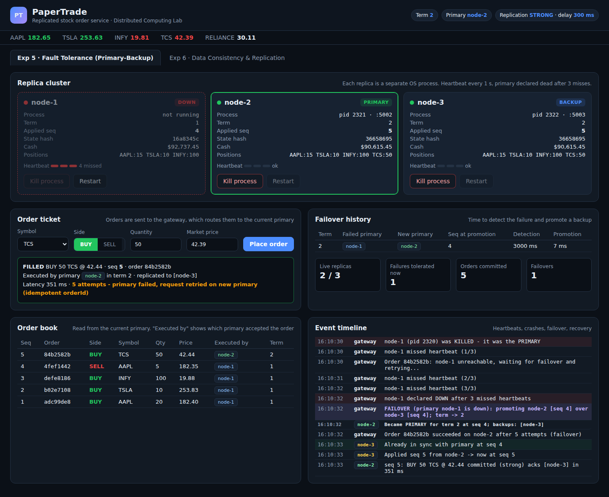

# PaperTrade: Replicated Stock Order Service

A paper-trading (simulated stock market orders) app built on a **3-replica primary-backup cluster**, for two Distributed Computing lab experiments:

| Experiment | Write-up |
|---|---|
| **Exp 5: Fault Tolerance with Primary-Backup Replication** | [docs/EXP5-Fault-Tolerance.md](docs/EXP5-Fault-Tolerance.md) |
| **Exp 6: Data Consistency and Replication** | [docs/EXP6-Data-Consistency.md](docs/EXP6-Data-Consistency.md) |
| **Exp 7: Load Balancing Algorithms** | [docs/EXP7-Load-Balancing.md](docs/EXP7-Load-Balancing.md) |

Screenshots of every step are in [`docs/screenshots/`](docs/screenshots).



## Run it

Needs only **Node.js 18+**. There are no npm dependencies.

```bash
npm start
# open http://localhost:3000
```

This starts the gateway on `:3000`, which in turn launches 3 replica processes on `:5001`, `:5002` and `:5003` (Exp 5 & 6), plus 4 app servers on `:6001`–`:6004` behind the load balancer (Exp 7). Each start is a fresh demo, because the `data/` folder is wiped.

## Architecture

```
               Browser (frontend/: HTML + CSS + JS)
                         |  REST (/api/...)
                         v
        +----------------------------------------+
        |  Gateway / cluster manager  :3000      |
        |  - heartbeats (1 s), failure detection |
        |  - failover + term (epoch) numbers     |
        |  - routes orders to the primary        |
        |  - market price feed                   |
        +----------------------------------------+
             |               |               |
       +-----------+   +-----------+   +-----------+
       |  node-1   |-->|  node-2   |   |  node-3   |
       |  PRIMARY  |---------------------->BACKUP  |
       |  :5001    |   |  BACKUP   |   |  :5003    |
       +-----------+   +-----------+   +-----------+
        each replica = separate OS process with
        in-memory state + durable log (data/node-X.json)
```

* **Replica** (`backend/replica.js`): holds cash, positions and orders. The primary validates an order, gives it the next **sequence number**, applies it, and replicates the log entry to the backups. Backups apply entries **strictly in sequence order** and buffer any that arrive early. This is state-machine replication, so identical logs produce identical state. The log is also written to disk, so a killed replica recovers on restart.
* **Gateway** (`backend/gateway.js`): the cluster manager. It sends a heartbeat every 1 s and declares a node down after 3 misses. When the primary fails, it promotes the backup with the **highest applied sequence number** and increments the **term**. Backups reject writes from older terms (fencing). Client orders are retried across a failover and de-duplicated by `orderId` (idempotency).
* **Frontend** (`frontend/`): a dashboard with one tab per experiment. It has **Kill process** and **Restart** buttons. Kill sends a real `SIGKILL` to the replica process.

### Replication modes (Exp 6)

| Mode | Client ACK after | Reads |
|---|---|---|
| **Strong** | all live backups applied (W = N) | any replica is up to date |
| **Quorum** | primary + 1 backup (W = 2) | R = 2 replicas, and since R + W > N a read is never stale |
| **Eventual** | primary only (W = 1), backups are updated asynchronously | backups can be stale and converge later |

A "simulated network delay" slider adds latency, with jitter, to every primary-to-backup message. The jitter lets messages arrive out of order.

## API (gateway)

| Method | Path | Description |
|---|---|---|
| GET | `/api/cluster` | nodes, roles, terms, seqs, state hashes, failovers, events |
| POST | `/api/order` | `{symbol, side: BUY/SELL, qty, orderId?}` |
| GET | `/api/portfolio?read=primary\|backup\|quorum` | read with a given read policy |
| POST | `/api/config` | `{mode: strong\|quorum\|eventual, lagMs}` |
| POST | `/api/nodes/:id/kill` / `restart` | crash / restart a replica process |
| POST | `/api/reset` | wipe everything and restart the cluster |
| GET | `/api/lb/state` | load balancer: servers, current test, history, events |
| POST | `/api/lb/config` | `{algorithm: round_robin\|weighted_round_robin\|least_connections\|random\|ip_hash, rate, duration}` |
| POST | `/api/lb/run` / `compare` / `stop` | run one load test / all five algorithms / stop |
| POST | `/api/lb/servers/:id/kill` / `restart` | crash / restart an app server |

## Regenerating the screenshots

With the app running, and Playwright installed (`npm i -g playwright`):

```bash
npm run screenshots          # Exp 5 & 6
npm run screenshots:exp7     # Exp 7
```

`scripts/screenshots.js` drives the real UI through every scenario in both experiments.
