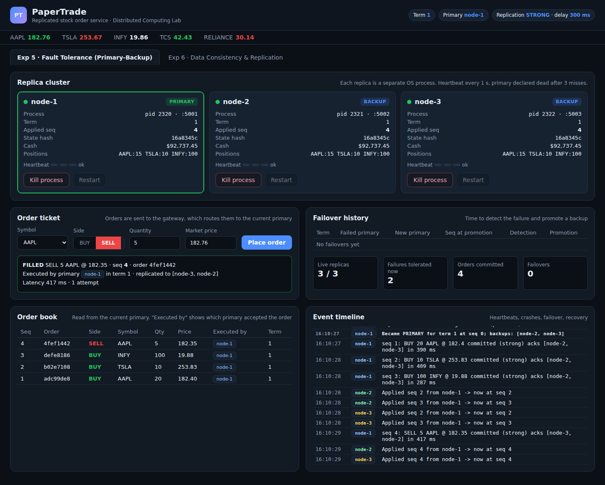
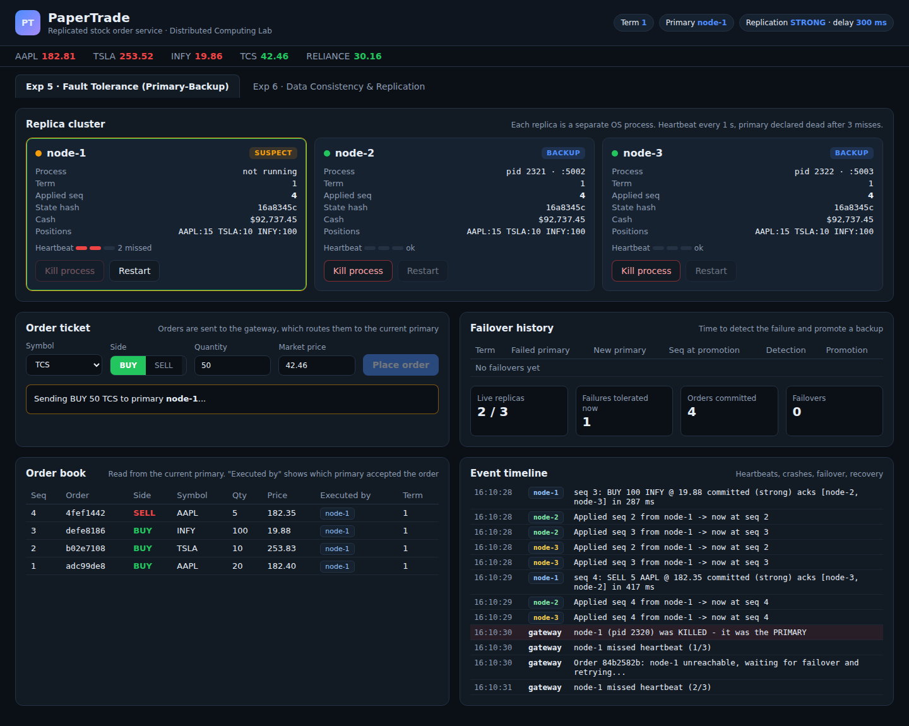
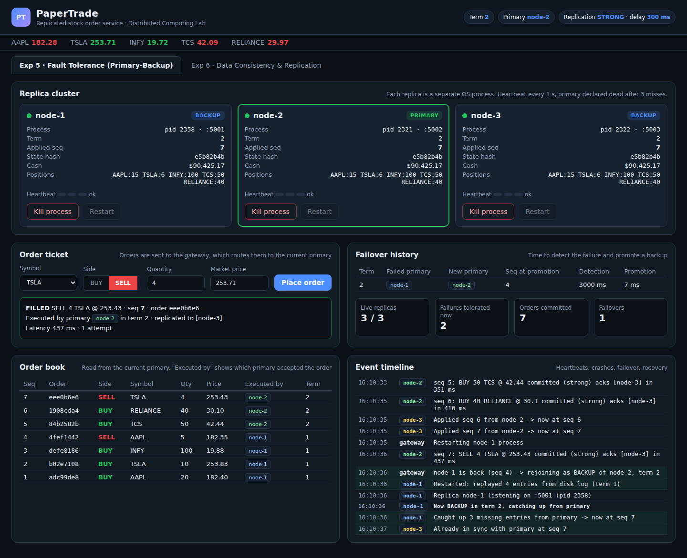
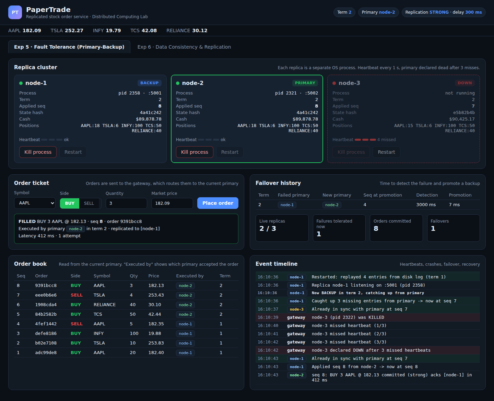

# Experiment 5: Fault Tolerance with Primary-Backup Replication

**Project:** PaperTrade, a stock market order (paper trading) system

## Aim

To make the order service of a paper-trading application fault tolerant using **primary-backup (passive) replication**, and to show that the system keeps accepting orders without losing committed data when the primary server or a backup server crashes.

## Theory

**Fault tolerance** is the ability of a system to keep providing its service when some of its components fail. The usual way to achieve it is **redundancy**: several copies (replicas) of the same server.

In **primary-backup replication**:

1. One replica is the **primary**. All client requests (orders) go to it.
2. The primary executes the request, then sends the update to every **backup**.
3. In synchronous mode, the primary replies to the client only after the backups have acknowledged. Every acknowledged order therefore exists on all live replicas.
4. **Failure detection:** a manager sends periodic **heartbeats**. A replica that misses several heartbeats in a row is declared failed.
5. **Failover:** if the primary fails, the most up-to-date backup is **promoted** to primary and clients are redirected to it.
6. **Recovery:** a failed replica that restarts rejoins as a backup and **catches up** on the updates it missed (state transfer).

Mechanisms used in this implementation:

| Mechanism | Purpose |
|---|---|
| Sequence numbers on every order | backups apply updates in the same order, so all replicas reach the same state |
| Heartbeat every 1 s, 3 misses = failure | failure detection with fewer false alarms from a single slow response |
| Promote the backup with the highest sequence number | no committed order is lost during failover |
| **Term (epoch) number**, incremented on each failover | backups reject messages from an old, stale primary (fencing) |
| Durable log on disk per replica | a crashed replica replays its log on restart |
| Catch-up from the primary's log on rejoin | a recovered replica gets the orders it missed |
| Client retry + idempotent `orderId` | an order sent during a failover is executed **exactly once** |

With **N = 3** replicas the service survives **N - 1 = 2** crash failures.

## System setup

* **Backend:** Node.js. A gateway / cluster manager on port 3000, and 3 replica processes (`node-1` to `node-3`) on ports 5001 to 5003.
* **Frontend:** HTML/CSS/JS dashboard (tab "Exp 5 · Fault Tolerance").
* Each replica is a **separate OS process**. "Kill process" sends a real `SIGKILL`.
* Replication mode: **strong (synchronous)**, with a 300 ms simulated network delay.

## Procedure and observations

### Step 1: Healthy cluster, orders replicated to all replicas

`npm start` launches the cluster: `node-1` is the PRIMARY and `node-2` and `node-3` are BACKUPs (term 1). Four orders were placed from the order ticket (BUY 20 AAPL, BUY 10 TSLA, BUY 100 INFY, SELL 5 AAPL).

**Observation:** every order is acknowledged only after both backups ack it ("acks [node-2, node-3]" in the timeline, ~300–400 ms). All three replicas show the same *applied seq (4)*, the same *cash* and the same **state hash (`8691ff38`)**, so they hold identical copies of the data.

### Step 2: The primary crashes

"Kill process" was clicked on `node-1` (the primary).

**Observation:** the process is gone ("not running"). The gateway's heartbeats to `node-1` fail. After the first miss the node is marked **SUSPECT**, and the heartbeat bar shows the missed beats (2/3). It is not declared dead yet, which avoids a failover caused by one slow reply. A new order (BUY 50 TCS) was placed at this moment. The ticket shows *"Sending BUY 50 TCS to primary node-1…"* and the gateway logs *"node-1 unreachable, waiting for failover and retrying"*.

### Step 3: Failure detected and failover to a backup

**Observation:**

* After **3 missed heartbeats (~3000 ms)** `node-1` is declared **DOWN**.
* The gateway performs a **FAILOVER**: it promotes `node-2` (seq 4, fully up to date) to PRIMARY and moves the cluster to **term 2**. The promotion itself took 7 ms.
* The pending TCS order was **not lost**. The gateway kept retrying it and it succeeded on `node-2` as seq 5 ("5 attempts – primary failed, request retried on new primary"). Because the order carries a unique `orderId`, a retry can never execute it twice.
* In the order book, orders 1 to 4 were *executed by node-1 in term 1* and order 5 was executed by `node-2` in term 2. **No committed order was lost.**
* The failover history table records the detection time and the promotion time.

### Step 4: The old primary recovers and rejoins as a backup

Two more orders were placed on the new primary, then `node-1` was restarted.

**Observation** (from the timeline):

1. `node-1` restarts and **replays 4 entries from its disk log**.
2. The gateway detects it is back and makes it a **BACKUP of node-2 in term 2**. It does not become primary again, because the old primary must not take over (term fencing).
3. `node-1` **catches up the 3 orders it missed** (seq 5 to 7) from the new primary.
4. All three replicas again have **seq 7 and identical state hash `e5b82b4b`**. The cluster is back to tolerating 2 failures.

### Step 5: A backup crashes, and the service is not interrupted

`node-3` (a backup) was killed and a new order was placed.

**Observation:** after `node-3` is declared DOWN the primary replicates only to the live backup (`node-1`). The order BUY 3 AAPL is filled normally (seq 8, 412 ms). A backup failure does **not** need a failover and clients see no interruption. When `node-3` is restarted it catches up the same way as in Step 4.

## Result

| Metric | Value observed |
|---|---|
| Failure detection time | ~3000 ms (3 × 1 s heartbeats) |
| Backup promotion time | 7 ms |
| Write latency (sync, 300 ms simulated delay) | ~300–440 ms |
| Committed orders lost on primary crash | **0** |
| Orders executed twice after client retry | **0** (idempotent orderId) |
| Failures tolerated with 3 replicas | 2 |

## Conclusion

Primary-backup replication made the PaperTrade order service fault tolerant. Heartbeat-based failure detection found the crashed primary in about 3 seconds. The most up-to-date backup was promoted automatically, and orders kept being accepted with **no loss of committed data**. Term numbers prevented a recovered old primary from acting as primary again. The durable log and catch-up protocol brought a recovered replica back to an identical state. The cost is the extra latency of synchronous replication (each order waits for backup acknowledgements) and a short unavailability window of about 3 s while the failure is being detected.
