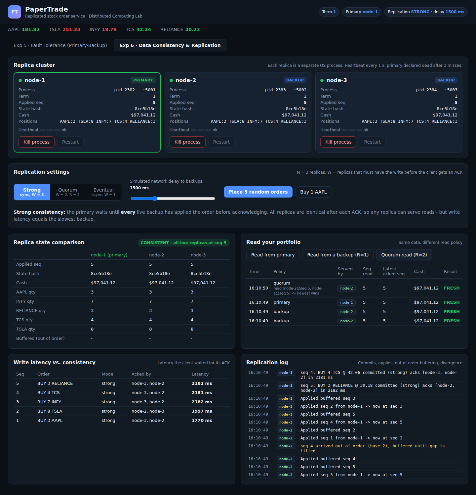
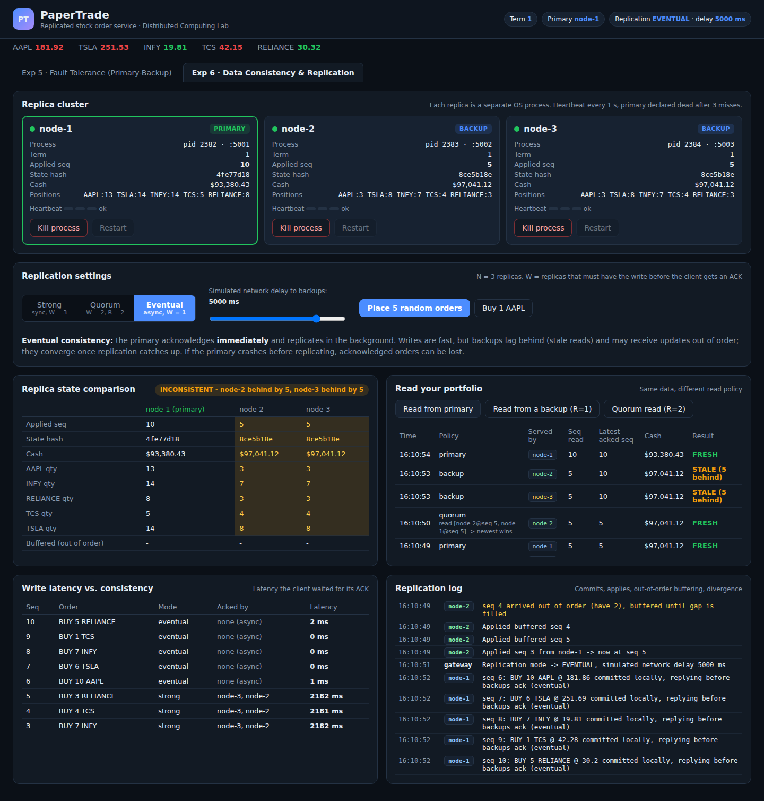
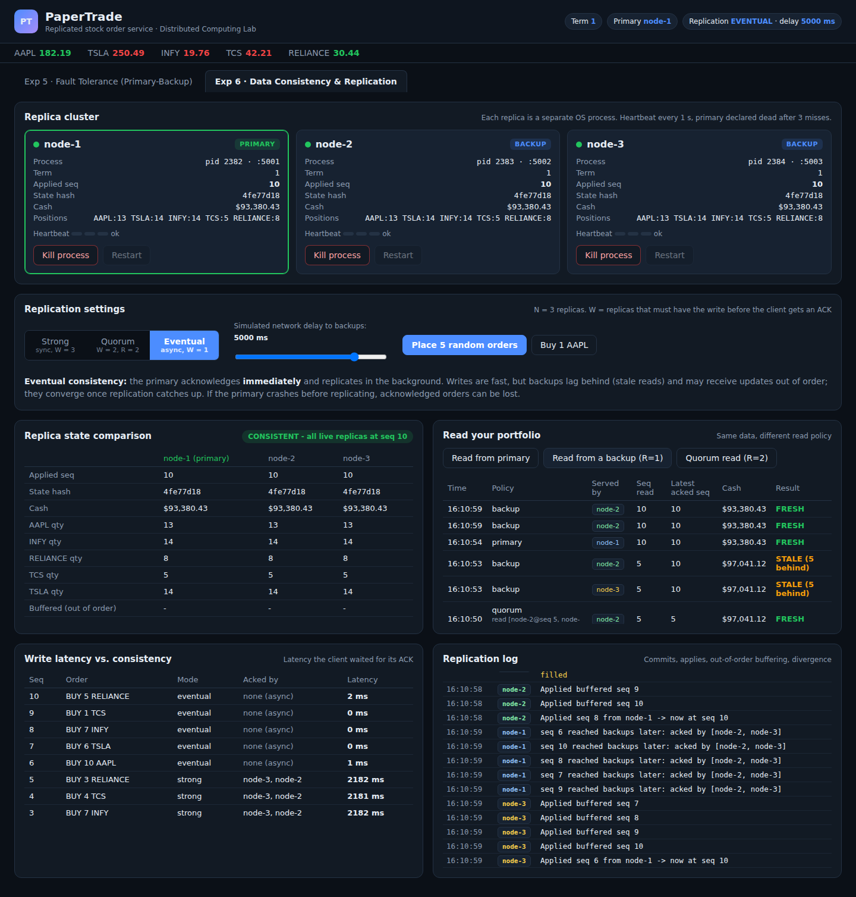
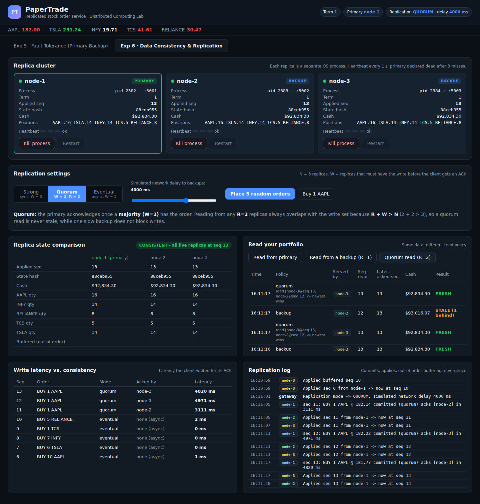
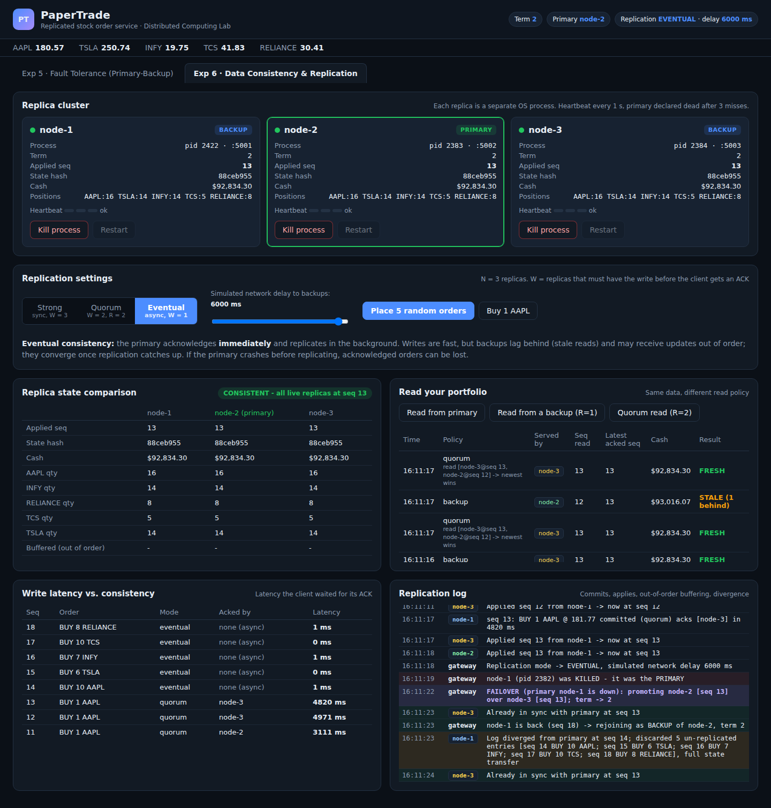

# Experiment 6: Data Consistency and Replication

**Project:** PaperTrade, a stock market order (paper trading) system

## Aim

To study how the **replication strategy** of the PaperTrade order service affects **data consistency** between replicas. The experiment compares **strong (synchronous)**, **quorum** and **eventual (asynchronous)** replication, and observes stale reads, convergence, out-of-order delivery, write latency and data loss on failover.

## Theory

When data is replicated, a write reaches the replicas at different times. A **consistency model** defines what a client may observe when it reads.

| Model | How writes are replicated | Guarantee |
|---|---|---|
| **Strong consistency** | synchronous: the write is acknowledged after **all** replicas applied it (W = N) | every read, from any replica, returns the latest acknowledged write |
| **Quorum consistency** | acknowledged after a **majority** applied it (W = 2 of 3); read from R = 2 replicas | because **R + W > N**, every read set overlaps the write set, so reads are never stale |
| **Eventual consistency** | asynchronous: acknowledged by the primary alone (W = 1), backups are updated in the background | backups may return **stale** data, but all replicas **converge** when updates stop |

Other concepts demonstrated:

* **Ordering / sequential consistency:** the primary gives each order a **sequence number**. Backups apply entries strictly in that order. An entry that arrives early (seq 8 before seq 6 and 7) is **buffered** until the gap is filled, so every replica goes through the same sequence of states.
* **Consistency check:** each replica computes a **state hash** (SHA-256 of seq, cash and positions). Equal hashes mean identical replicas.
* **Trade-off (CAP / PACELC):** stronger consistency means higher write latency. Weaker consistency gives faster writes but stale reads. With asynchronous replication, **acknowledged writes can be lost** if the primary crashes before they reach a backup.

## System setup

* 3 replicas (`node-1` is the primary, `node-2` and `node-3` are backups), plus a gateway, all in Node.js.
* Frontend tab "Exp 6 · Data Consistency & Replication" contains:
  * mode selector (Strong / Quorum / Eventual) and a **simulated network delay** slider. The delay is applied to every primary-to-backup message with ±50 % jitter, so messages can be reordered.
  * **Replica state comparison** table: seq, state hash, cash and holdings per replica. Cells that differ from the primary are highlighted.
  * **Read your portfolio** with three read policies: primary, one backup (R = 1), quorum (R = 2). Each read is marked FRESH or STALE, compared with the latest write acknowledged to a client.
  * **Write latency** table and **replication log**.

## Procedure and observations

### Step 1: Strong consistency (synchronous, W = 3)

Mode **Strong**, network delay 1500 ms. Five concurrent orders were placed, then the portfolio was read from backups, the primary and a quorum.

**Observation:**

* Each write took **~1.8 to 2.2 s**. The client waits until *both* backups have applied the order, so the latency is set by the slowest backup.
* After the ACKs all replicas show **seq 5 and the same hash `8ce5b18e`**. The comparison table shows **CONSISTENT**.
* **Every read is FRESH**, including reads from a backup.
* The log shows *"seq 4 arrived out of order (have 2), buffered until gap is filled"*. The network reordered the messages, but the backup applied them in sequence order (3, 4, 5), so ordering was preserved.

### Step 2: Eventual consistency (asynchronous, W = 1): stale reads

Mode **Eventual**, network delay 5000 ms. Five more orders were placed, and the portfolio was read immediately.

**Observation:**

* Writes are acknowledged in **0 to 2 ms** because the primary does not wait for backups.
* The primary is at **seq 10** while both backups are still at **seq 5**. The table shows **INCONSISTENT: node-2 behind by 5, node-3 behind by 5**, with different cash, holdings and hashes.
* Reads from both backups return **STALE data** (cash $97,041.12 instead of $93,380.43; 5 orders behind). A read from the primary is fresh.

### Step 3: Eventual consistency: convergence

No new orders were placed for a few seconds.

**Observation:** the delayed replication messages arrive and the buffered entries are applied in order ("Applied buffered seq 7, 8, 9, 10"). The primary logs *"seq N reached backups later: acked by [node-2, node-3]"*. All replicas reach **the same seq and the same state hash** and the table returns to **CONSISTENT**. Backup reads are now **FRESH**. This is the defining property of eventual consistency: *if no new updates are made, all replicas eventually converge to the same value.*

### Step 4: Quorum (W = 2, R = 2)

Mode **Quorum**, delay 4000 ms. Single orders were placed. Immediately after each ACK the portfolio was read from one backup (R = 1) and with a quorum read (R = 2).

**Observation:**

* Write latency is **~3.1 to 5.0 s**, the time until the *first* backup acks. A slow backup does not block the write, unlike Strong mode where the client waits for the slowest.
* Right after the ACK of seq 13, the slower backup `node-2` had not applied it yet. A **backup read that hit `node-2` returned seq 12, which is STALE (1 behind)**.
* **Every quorum read was FRESH.** For example, *"read [node-3@seq 13, node-2@seq 12] → newest wins"*. The quorum read also contacted the stale `node-2`, but the second replica in the read set had the write.
* A few seconds later `node-2` also applied seq 13. By the time the screenshot was taken the comparison table was back to CONSISTENT. Any 2 of the 3 replicas include at least one replica that has the latest write, because R + W = 2 + 2 > N = 3.

### Step 5: Eventual consistency + primary crash = lost writes and divergence

Mode **Eventual**, delay 6000 ms. Five orders were placed and acknowledged to the client. The primary `node-1` was **killed before replication finished**, then restarted after the failover.

**Observation:**

* The five orders (seq 14 to 18) were acknowledged to the client in 0 to 1 ms, but existed **only on node-1**.
* The failover promoted `node-2`, whose latest entry was **seq 13**. Term moved to 2.
* When `node-1` restarted, its log **diverged** from the new primary: *"Log diverged from primary at seq 14; discarded 5 un-replicated entries [seq 14 BUY 10 AAPL; seq 15 BUY 6 TSLA; …], full state transfer"*.
* All replicas are consistent again at seq 13, but **5 orders that the user was told were filled have disappeared**. This is the durability cost of asynchronous replication. The same crash under Strong or Quorum mode (Exp 5) lost **zero** acknowledged orders.

## Result

| Mode | W (acks) | Write latency (observed) | Backup read (R = 1) | Quorum read (R = 2) | Acked writes lost if primary crashes |
|---|---|---|---|---|---|
| Strong | 3 | ~1.8–2.2 s (delay 1.5 s) | always fresh | fresh | none |
| Quorum | 2 | ~3.1–5.0 s (delay 4 s) | can be stale | **always fresh** | none |
| Eventual | 1 | **0–2 ms** | stale until converged | can be stale | **yes** (5 lost in Step 5) |

## Conclusion

Replication keeps several copies of the trading data, and the **replication protocol decides how consistent those copies are**. Synchronous (strong) replication kept every replica identical after each order but made each order as slow as the slowest backup. Asynchronous (eventual) replication gave near-zero write latency, but backups served stale portfolios and received updates out of order. Sequence numbers with buffering kept the apply order correct, and the replicas converged once updates stopped. However, a primary crash lost orders that had already been acknowledged. **Quorum replication (R + W > N)** gave a middle ground: reads were always consistent and a slow replica did not block writes. For a trading system, where an acknowledged order must never disappear, strong or quorum replication is the appropriate choice.
