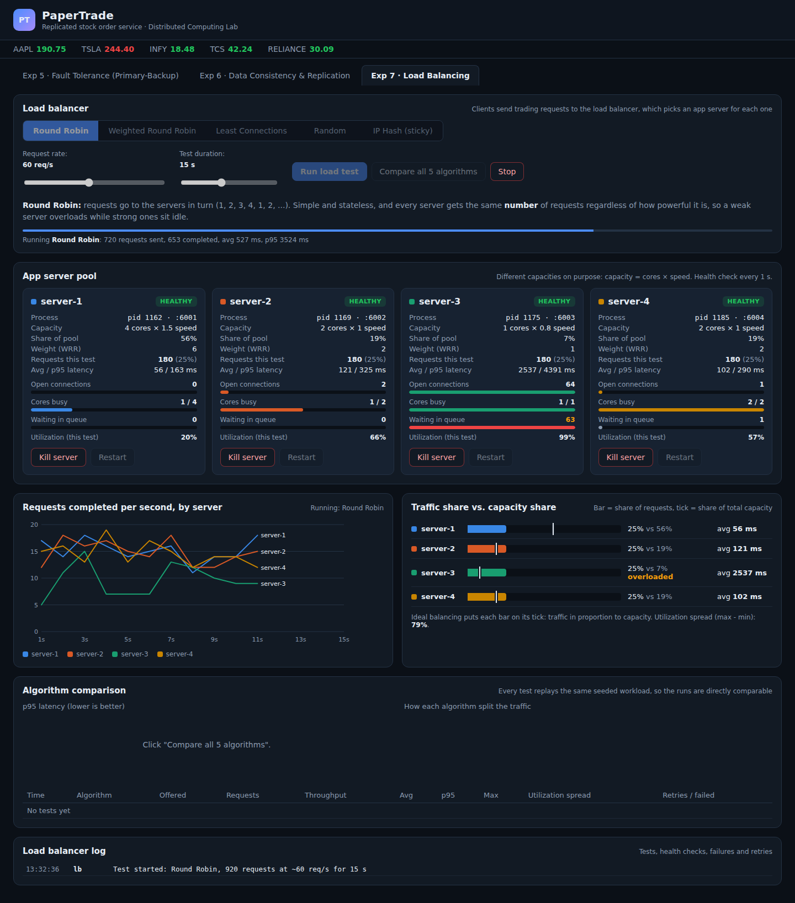
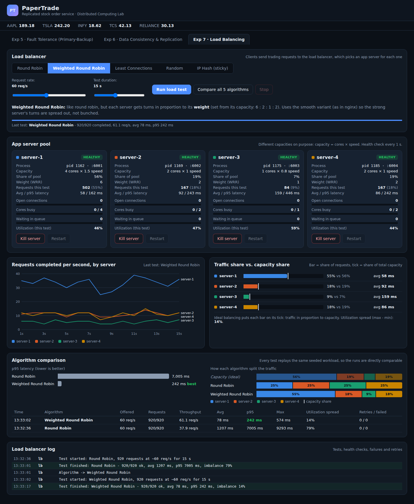
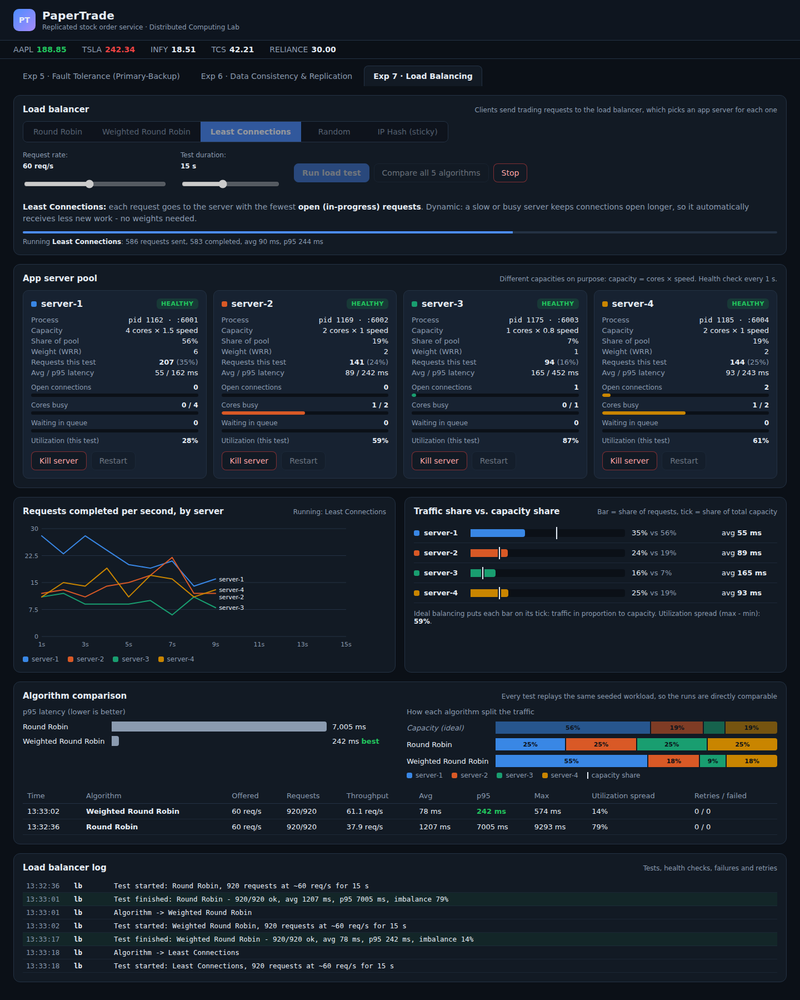
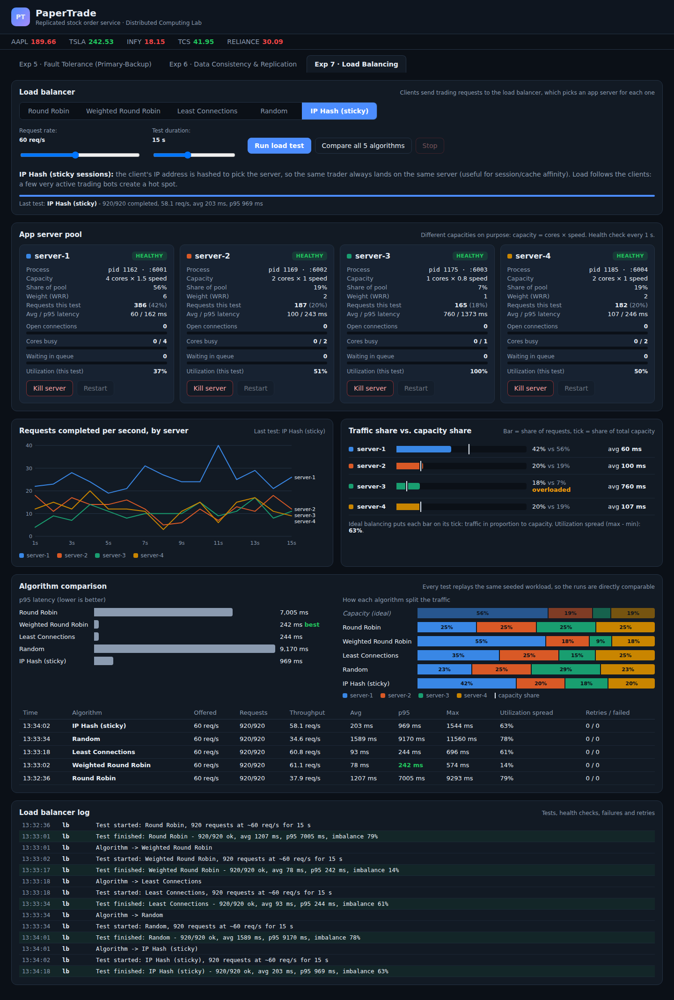
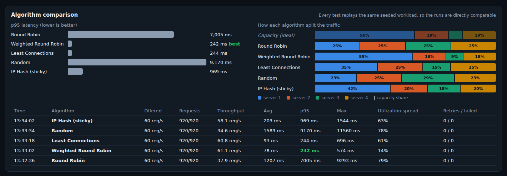
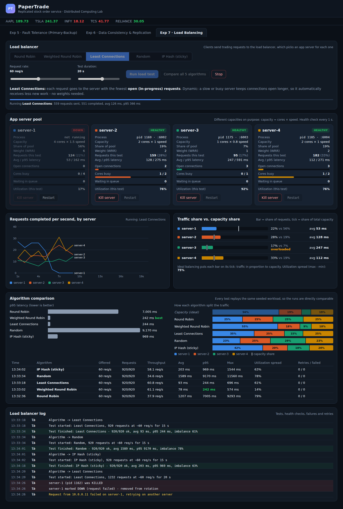
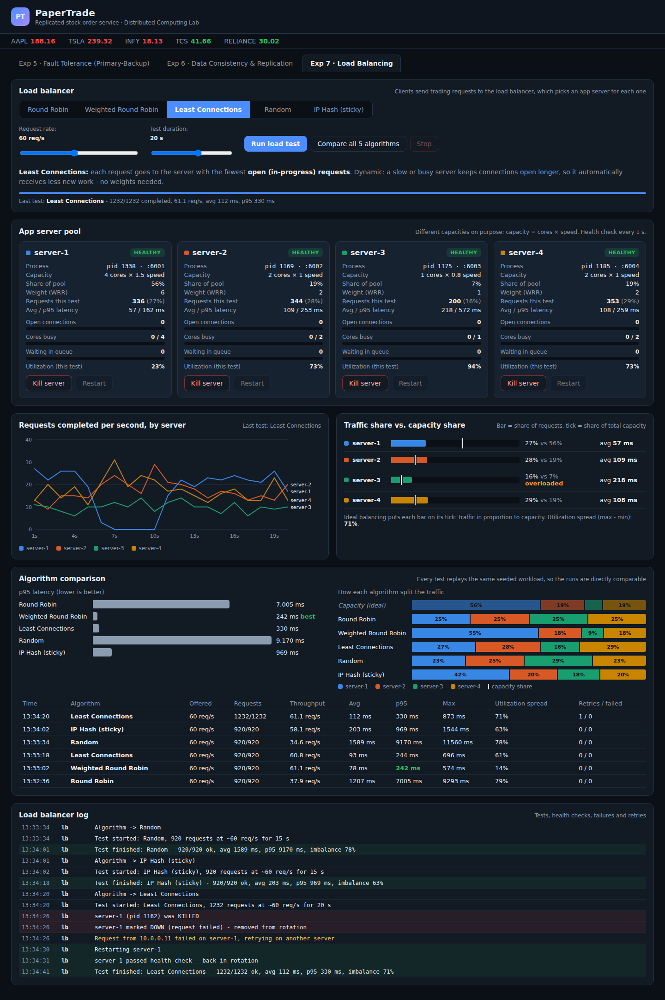

# Experiment 7: Load Balancing Algorithms

**Project:** PaperTrade, a stock market order (paper trading) system

## Aim

To implement a load balancer for the PaperTrade request-processing tier and compare **Round Robin, Weighted Round Robin, Least Connections, Random and IP Hash**. The comparison covers how each algorithm distributes the same trading workload over servers of different capacity, the response time clients see, and how the load balancer handles a server failure.

## Theory

A **load balancer** sits between clients and a pool of servers that all provide the same service. For every incoming request it chooses one server. The goals are to use every server's capacity, avoid overloading any single server (which gives long queues and slow responses), and keep the service available when a server fails.

| Algorithm | How it picks a server | Type | Strength | Weakness |
|---|---|---|---|---|
| **Round Robin** | servers in turn: 1, 2, 3, 4, 1, 2, ... | static | simple, stateless, equal request counts | ignores server capacity and request cost |
| **Weighted Round Robin** | in turn, but server *i* gets *wᵢ* turns per cycle (weights ∝ capacity) | static | matches heterogeneous capacity | weights must be configured; blind to actual load |
| **Least Connections** | the server with the fewest open (in-progress) requests | dynamic | adapts to slow servers and expensive requests automatically | needs connection tracking; ties at low load |
| **Random** | uniformly random server | static | no state at all | same capacity blindness as round robin, plus random bursts |
| **IP Hash** | `hash(client IP) mod N` | static, sticky | same client → same server (session / cache affinity) | load follows clients: heavy clients create hot spots; removing a server remaps clients |

**Static** algorithms decide without looking at the servers' current state. **Dynamic** ones use run-time information such as open connections.

Health checking keeps failed servers out of rotation. *Active* health checks probe every server periodically. *Passive* checks react to failed requests. A request that fails is **retried** on another server.

## System setup

```
 Traders (24 client IPs, Poisson arrivals, same seeded workload every test)
                     |
                     v
          +----------------------+      health check every 1 s
          |   Load balancer      |----> active connection count per server
          |   (gateway :3000)    |      retry once on failure
          +----------------------+
           |       |       |      |
       server-1 server-2 server-3 server-4      (separate OS processes)
       4 cores  2 cores  1 core   2 cores
       x1.5     x1.0     x0.8     x1.0
       56 %     19 %     7 %      19 %   <- share of pool capacity
       weight 6 weight 2 weight 1 weight 2
```

* **App servers** (`backend/appserver.js`): each request uses one core for `cost × 40 ms / speed`. When all cores are busy, requests wait in a FIFO queue.
* **Workload:** quotes (cost 1, 60 %), order validation (cost 2, 25 %) and portfolio reports (cost 6, 15 %), at **60 requests/s** for **15 s**, about 920 requests. A few "trading bot" IPs send most of the traffic (a skewed distribution). The workload is generated from a fixed random seed, so **every algorithm receives exactly the same requests**.
* **Load balancer** (`backend/loadbalancer.js`): implements the five algorithms. Weighted Round Robin uses the *smooth* variant used by nginx. The balancer tracks open connections, health-checks each server every second and retries a failed request once on another server.
* **Frontend:** the tab "Exp 7 · Load Balancing". It has an algorithm selector, request-rate and duration controls, live server cards (open connections, busy cores, queue, utilization), a live requests-per-second chart, a traffic-share vs capacity-share chart, and an algorithm comparison.

## Procedure and observations

### Step 1: Round Robin overloads the weak server

Algorithm **Round Robin**, 60 req/s. Screenshot taken about 11 s into the test.



**Observation:**

* Every server received exactly **180 requests (25 %)**, although server-3 has only **7 %** of the pool's capacity.
* server-3 is saturated: **utilization 99 %, 64 open connections, 63 requests waiting in its queue**, and an average latency of **2537 ms** (p95 4391 ms).
* Meanwhile the strongest server, server-1, is **only 20 % utilized** with an empty queue, at an average of 56 ms.
* Final result: avg **1207 ms**, p95 **7005 ms**, max 9293 ms. Throughput was only **37.9 req/s** for 60 req/s offered, because the test had to wait for server-3's backlog to drain.

### Step 2: Weighted Round Robin matches traffic to capacity



**Observation:**

* With weights 6 : 2 : 1 : 2, the traffic split is **55 % / 18 % / 9 % / 18 %**. That almost exactly matches the capacity split of 56 / 19 / 7 / 19 (each bar ends on its capacity tick).
* All servers are moderately loaded (44 to 59 % utilization), with **no queues**. The utilization spread is only **14 %**.
* Latency drops from 1207 ms to **avg 78 ms, p95 242 ms**, and throughput keeps up with the offered load (**61.1 req/s**).

### Step 3: Least Connections adapts without any weights

Screenshot taken during the test.



**Observation:**

* The balancer knows nothing about the servers' capacities. It only sees open connections: server-3 keeps its connections open longer (slow core), so it automatically gets fewer new requests (**15 %** vs 25 % under round robin).
* Result: avg **93 ms, p95 244 ms**, throughput 60.8 req/s. That is practically as good as weighted round robin, with no configuration.
* server-1 was used less (35 %, 28 % utilized) than under WRR. At this load most servers are often idle with 0 open connections, and ties are broken in rotation. Least connections only steers traffic away from servers that are actually busy. This is why its utilization spread (61 %) is higher, even though latency is low.

### Step 4: Random and IP Hash



**Observation:**

* **Random** behaves like round robin, but worse: 23 / 25 / **29** / 23 %. By chance, server-3 got even *more* traffic, which gave the worst result of all: avg **1589 ms, p95 9170 ms, max 11.6 s**.
* **IP Hash** splits traffic by client, not by request: **42 / 20 / 18 / 20 %**. Every request from a trader goes to the same server (sticky sessions). The split depends on which heavy clients hash to which server. Here the busiest bot IPs happened to hash to server-1, which helped, but server-3 still received 18 % and was **100 % utilized** (avg 760 ms). Result: avg 203 ms, p95 **969 ms**. Better than round robin, but with much worse tail latency than WRR or least connections.

### Step 5: Comparison of all five algorithms



The "Capacity (ideal)" row shows the split that would load every server equally. Weighted round robin is closest to it. Round robin and random ignore it completely.

### Step 6: Server failure during a test

A 20 s **Least Connections** test was started. After about 6 s the biggest server, **server-1, was killed**.



**Observation:**

* The first request that failed on server-1 made the balancer **mark it DOWN immediately** (passive health check) and **retry that request on another server** (*"Request from 10.0.0.11 failed on server-1, retrying on another server"*).
* The live chart shows server-1's line dropping to 0. Its traffic moves to the other three servers, whose utilization rises to 76 / 92 / 76 %. No request was lost.

Then server-1 was restarted:



**Observation:** the next active health check found server-1 healthy (*"server-1 passed health check - back in rotation"*) and least connections immediately sent it traffic again (its line climbs back in the chart). The whole test completed **1232/1232 requests with 1 retry and 0 failures**, avg 112 ms, p95 330 ms.

## Result

Same workload for every algorithm (≈920 requests, 60 req/s, 15 s):

| Algorithm | Split (S1/S2/S3/S4) | Throughput | Avg latency | p95 latency | Max | Utilization spread |
|---|---|---|---|---|---|---|
| Capacity (ideal) | 56 / 19 / 7 / 19 % | - | - | - | - | 0 % |
| Round Robin | 25 / 25 / 25 / 25 % | 37.9 req/s | 1207 ms | 7005 ms | 9293 ms | 79 % |
| **Weighted Round Robin** | 55 / 18 / 9 / 18 % | **61.1 req/s** | **78 ms** | **242 ms** | 574 ms | **14 %** |
| **Least Connections** | 35 / 25 / 15 / 25 % | 60.8 req/s | 93 ms | 244 ms | 696 ms | 61 % |
| Random | 23 / 25 / 29 / 23 % | 34.6 req/s | 1589 ms | 9170 ms | 11560 ms | 78 % |
| IP Hash | 42 / 20 / 18 / 20 % | 58.1 req/s | 203 ms | 969 ms | 1544 ms | 63 % |

Failure test (least connections, 20 s, server-1 killed and restarted): **1232/1232 completed, 1 retry, 0 failed.**

## Conclusion

With servers of **different capacity**, the choice of load-balancing algorithm decided whether the system ran smoothly or fell over. **Round Robin** and **Random** gave every server the same number of requests. They overloaded the weakest server (99–100 % utilization, a queue of 60+ requests, p95 latency of 7–9 s) while the strongest server sat 80 % idle. **Weighted Round Robin** matched traffic to capacity and gave the best latency (p95 242 ms), but only because its weights were configured correctly. **Least Connections** reached nearly the same latency (p95 244 ms) **without any configuration**, because it reacts to real-time load, so it is the most robust general choice. **IP Hash** provides session affinity at the cost of uneven, client-dependent load. Health checks plus retry let the balancer survive a server crash with **no failed requests** and re-add the server automatically when it recovered.
